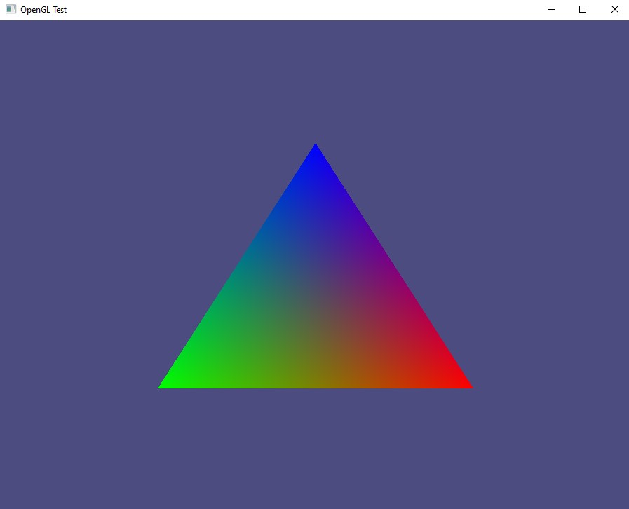

# OpenGL Test

I am wanting to learn rust and have a project idea in mind that might use OpenGL
so this repo serves as an experimenting playground for me to get a feel for the
language and how it plays with OpenGL

Currently I have the classic OpenGL tutorial triangle _fairly_ safely implimented

